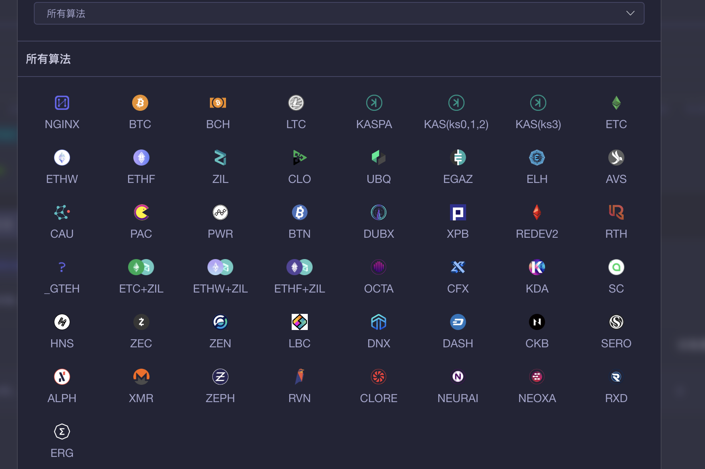
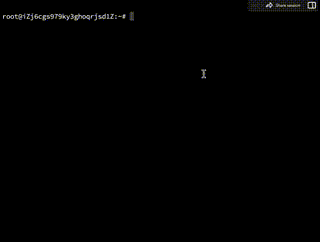

<div id="top"></div>

<div align="center">


<h1>开源矿工首款矿池中转软件</h1>
<h2>NTminerProxy做最好的矿池中转软件</h2>



<br>
<br>

<!-- <a href="https://github.com/CakeSystem/CakeMinerProxy">简体中文</a>｜<a href="https://github.com/CakeSystem/CakeMinerProxy/tree/main/Readme/i18n">English</a> -->

</div>

# NTminerProxy

<table>

   <tr>
   <td>
<span id="anzhuang"></span>

### 👉 **项目简介**
   <p>NTminerProxy受香港法律监管。请注意，不同国家/地区的法律要求可能会限制此类产品和服务。</p>
   <p>因此，该产品和服务以及某些功能可能不可用，或者在某些司法管辖区或地区或某些用户中可能受到限制。</p>
   <p>本产品并非VPN类型产品, 因为他无法使不允许地区访问禁止访问的内容。</p>
   <p>本产品为矿机、矿场管理软件，并非通过不正当手段获取矿机数据, 所有接入的设备均需设备拥有者主动设置矿机连接地址，以此确保任意使用本程序的客户拥有知情权。</p>
   <p>您不在任何恐怖活动组织及恐怖活动人员名单中，如联合国安理会决议中所列的恐怖活动组织及恐怖活动人员名单。</p>
   <p>您未被任何国家或地区的行政执法机构限制或禁止使用本程序。</p>
   <p>您非古巴、伊朗、朝鲜、叙利亚以及其他受到相关国家政府或国际机构执行制裁的国家或地区居民。</p>
   <p>您非限制或禁止开展数字货币相关活动国家或地区的居民，包括但不限于中国大陆地区等。</p>
   <p>您使用本程序提供的服务在您所在的国家或地区符合相关法律法规和政策。</p>
   <p>您同意：如因您所在国家或地区的法律法规和政策或其他任何适用法律的原因，导致您使用本程序的服务违法，您将独立承担相关法律风险和责任，您无条件且不可撤销地放弃向本程序进行追索的权利。</p>
   <p>您应该理解并遵守当地的法律法规。如果您使用此产品，默认代表将接受上述许可证。如果本产品引起的法律问题与本产品无关。</p>


### 👉 **Linux安装**

   <p>&emsp;&emsp;运行以下shell指令以运行工具包</p>

   ```sh
bash <(curl -s -L https://github.com/NTminerProxy/NTminerProxy/raw/master/ntinstall.sh)
   ```
   
   <p>&emsp;&emsp;成功运行后，您将看到以下菜单, 根据提示安装即可。</p>
   
   &nbsp;&nbsp;&nbsp;&nbsp;&nbsp;&nbsp;&nbsp;

   <p>&emsp;&emsp;默认后台账号密码为 qzpm19kkx xloqslz913</p>

   </td>
   </tr>
   <tr>
   <td>

### 👉 **Windows安装**

   <p>&emsp;&emsp;请直接从此项目的Windows目录下载指定的版本：</p>

   ```sh
https://github.com/NTminerProxy/NTminerProxy/tree/master/windows
   ```
   通过浏览器，输入IP地址+端口号，即可登录网页，配置中转地址。
   <p>&emsp;&emsp;Windows版本直接双击启动即可。</p>

   <p>&emsp;&emsp;默认后台账号密码为 qzpm19kkx xloqslz913</p>
   通过浏览器，输入IP地址+端口号，即可登录网页，配置中转地址。
   </td>
   </tr>   
   <tr>
   <td>
  
### 👉 **支持的算法及币种**

<p>&emsp;&emsp;对于支持的算法，相应的货币将随时热更新</p>

```text
  算法                支持的币种
  SHA256              BTC、BCH        
  ETHASH              ETC、ETHW、ETHF、OCTA、 ETC+ZIL、ETHW+ZIL、ETHF+ZIL、CLORE、NEURAI、NEOXA、ZIL、CLO、UBQ、EGAZ、ELH、AVS、CAU、PAC、PWR、BTN、DUBX、XPB、REDEV2、RTH
  SCRYPT              LTC
  KHEAVYHASH          KASPA
  KARLSENHASH         KLS
  BLAKE2S             KDA
  BLAKE2B             SC、HNS
  OCTOPUS             CFX
  DYNEXSOLVE          DNX
  EAGLESONG           CKB
  EQUIHASH            ZEN、ZEC
  LBRY                LBC
  X11                 DASH、BLOCX
  PROGPOW             SERO
  BLAKE3              ALPH
  RANDOMX             XMR、ZEPH、NEVO
  KAWPOW              RVN、MEWC
  SHA512256D          RXD
  AUTOYKOS2           ERG                
  NEXAPOW             NEXA
  GHOSTRIDER          RTM、RTC、MECU、MAXE、NIKI、SUBI、NEVO
```


   </td>
   </tr>
   <tr>
   <td>

<span id="liaotian"></span>


### 👉 **加入聊天组**

<p>&emsp;&emsp;开源21群：147980407</p>

<!-- <p>&emsp;&emsp;Discord: <a href="https://discord.gg/xpjRnv8wpX">https://discord.gg/xpjRnv8wpX</a></p> -->

   </td>
   </tr>
   <tr>
   <td>

<span id="gengxin"></span>

### 👉 **更新日志**


```
   3.9.7版本已发布
   修复ZEPH相关BUG
   增加SDR
   重构了端口编辑、添加窗口
```


   </td>
   </tr>
   <tr>
   <td>

<span id="dingzhi"></span>

   </td>
   </tr>
   <tr>
   <td>

### 👉 **针对E9pro的一些优化措施**

   <p>&emsp;&emsp;矿机的后台配置里, 只保留一条地址配置信息, 删除2和3的配置</p>

   </td>
   </tr>
   <tr>
   <td>

### 👉 **端口导入、导出**

   <p>&emsp;&emsp;三种方式可以进行端口的导入导出, 此处仅强调EXCEL文件导入, 如需使用Excel导入, 请下载并参照Excel模板文件:</p>

   <p>&emsp;&emsp;<a href="https://github.com/CakeSystem/CakeMinerProxy/raw/main/excel%E7%AB%AF%E5%8F%A3%E5%AF%BC%E5%85%A5%E6%A8%A1%E6%9D%BF.xlsx">下载Excel模板</a></p>

   </td>
   </tr>

   <tr>
   <td>

### 👉 **Other issues**

   <p>&emsp;&emsp;这是一个免费软件，不收取任何费用。从技术角度来看，它只需要终端设备计算能力的0.2%作为技术回报。</p>

   </tr>
   </td>

</table>


[CakeMinerProxy.io]: https://github.com/CakeSystem/CakeMinerProxy
[CakeMinerProxy.io-badge]: https://img.shields.io/badge/CakeMinerProxy-v3.7.3-green?logo=Cake
[downloads-badge]: https://img.shields.io/github/downloads/ajeetdsouza/zoxide/total?logo=github&logoColor=white&style=flat-square
[releases]: https://github.com/CakeSystem/CakeMinerProxy/releases
[stars-url]: https://github.com/CakeSystem/CakeMinerProxy/stargazers
[stars-shield]: https://img.shields.io/github/stars/CakeSystem/CakeMinerProxy.svg?style=flat
[stars-url]: https://github.com/CakeSystem/CakeMinerProxy/stargazers
